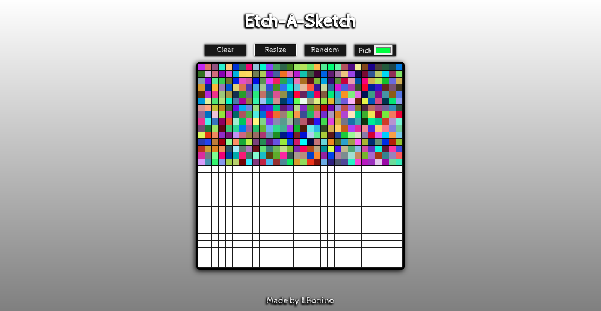
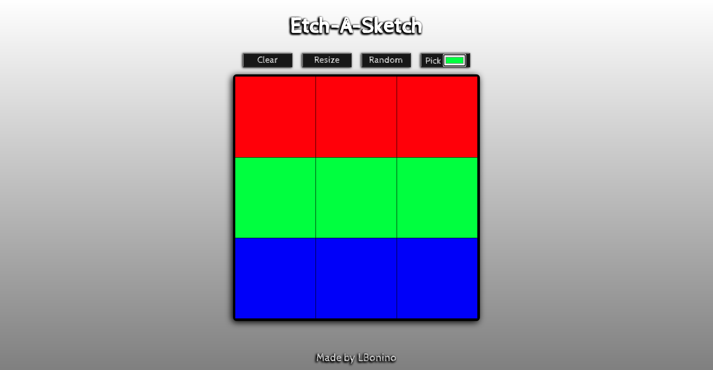

# etch-a-sketch
A browser version of something between a sketchpad and an [Etch-A-Sketch](https://en.wikipedia.org/wiki/Etch_A_Sketch).

This project is part of [The Odin Project Curriculum](https://www.theodinproject.com/paths/foundations/courses/foundations/lessons/etch-a-sketch-project).

## How to use
Visit this [webpage](https://lbonino.github.io/etch-a-sketch/src/templates/index.html).

Above the grid are 4 buttons:
### Clear
Clears the entire grid (it just paints it white).

### Resize
Lets the user enter the number of squares per dimension, then resizes the grid according to the entered value.

### Random
Squares can be painted with random colors which are generated when hovering over the elements in the grid.

### Pick
Lets the user pick a specific color.

To paint a square just hover over it.

## Preview

